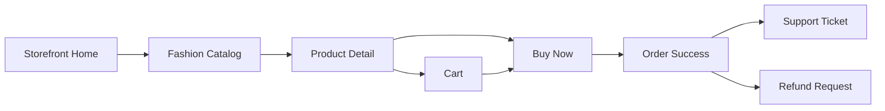
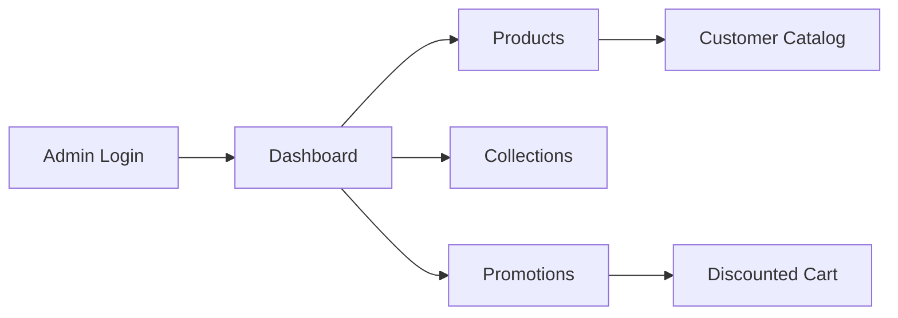
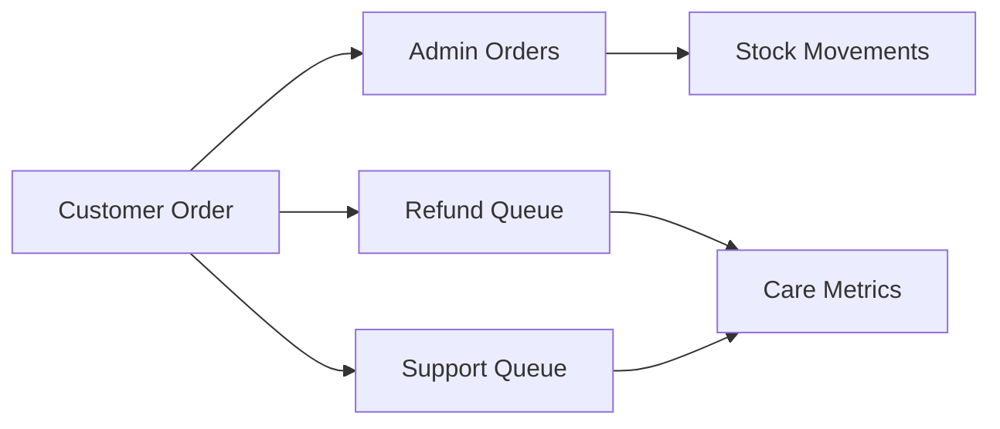

# NovaCart Multi-Merchant Ecommerce Website Builder

NovaCart is a production-style portfolio SaaS ecommerce platform where many merchants can create, customize, manage, and publish their own online stores. It now includes a platform marketing website, merchant onboarding flow, template selector, store builder controls, protected merchant admin workspace, and generated customer storefront routes.

NovaCart is original in naming, layout, copy, seed data, and local artwork. It is a demo-safe project, not a live payment-processing store.

## Platform Direction

NovaCart is no longer positioned as one fashion store. It is a website builder and commerce operations platform for independent merchants.

- Public platform site: `/`, `/features`, `/templates`, `/pricing`
- Merchant access: `/login`, `/signup`, `/onboarding`
- Merchant workspace: `/admin/dashboard`, `/admin/store-setup`, `/admin/products`, `/admin/orders`, `/admin/customers`, `/admin/inventory`, `/admin/promotions`, `/admin/analytics`, `/admin/templates`, `/admin/theme-editor`, `/admin/support`, `/admin/refunds`, `/admin/settings`
- Generated storefronts: `/store/demo-fashion`, `/store/demo-sports`, `/store/demo-home`, `/store/demo-boutique`
- Store-specific shopping paths: `/store/:storeSlug/products`, `/store/:storeSlug/products/:productId`, `/store/:storeSlug/cart`, `/store/:storeSlug/checkout`, `/store/:storeSlug/order-success`, `/store/:storeSlug/support`

## Visual Preview

### Premium Storefront


### Fashion Catalog


### Product Detail


### Cart And Checkout


### Order Confirmation And Care


### Merchant Operations Dashboard


### Catalog Operations


### Orders, Care, And Analytics


## What NovaCart Is

NovaCart is a multi-merchant ecommerce website builder. Merchants can choose a template, define store basics, add products, configure brand settings, preview the generated storefront, and operate commerce workflows from a dashboard.

The project demonstrates real ecommerce architecture: a Spring Boot REST API, MySQL persistence, JPA entities, DTO validation, service-layer business logic, JWT-protected admin APIs, transactional checkout, stock movement tracking, Vue 3 platform and storefront experiences, and a merchant admin workspace.

## Multi-Merchant Store Builder

- Merchant onboarding creates a store name, slug, category, description, template, first products, brand color, logo text, currency, and shipping message.
- Template options include Fashion Boutique, Thrift Classic, Sports Gear, Home Living, and Minimal Modern.
- Store switcher lets the admin workspace move between demo and merchant-created stores.
- Theme editor updates logo text, brand color, hero copy, announcement text, font style, and button style through a frontend store data layer.
- Generated storefronts use store-specific names, colors, template styling, categories, products, cart, and local demo checkout.
- Backend groundwork includes `MerchantAccount` and `MerchantStore` entities, repositories, seed demo stores, and public store lookup endpoints.

## Generated Customer Storefronts

- Storefronts live under `/store/:storeSlug`, which keeps the platform homepage separate from merchant stores.
- Each storefront displays the merchant logo/name, selected template style, announcement bar, hero section, category navigation, featured products, product grid, variant-aware product detail pages, cart, checkout, order success, and support/refund request flow.
- Demo stores are included for fashion, sports, home goods, and a minimal boutique so visitors can see multiple merchant storefronts.
- Generated storefront imagery uses original local demo JPEG assets under `frontend/public/demo-images` for realistic ecommerce photography-style previews.
- Generated storefront checkout is demo-safe and local for mock stores. The existing backend checkout remains available for backend-powered commerce flows.

## Merchant Admin

- JWT-protected admin login with persisted session handling and clear expired-session behavior.
- Dashboard with current store context, store setup checklist, revenue, order, visitor, conversion, average order value, refund, support, stock, sales trend, top products, and quick actions.
- Store setup page for details, slug, description, shipping message, preview, and publish state.
- Templates page and theme editor for store builder workflows.
- Product management with thumbnail table, search, status/category/collection/sale filters, active/draft/archive status, stock badges, featured markers, preview links, edit links, archive/reactivate, bulk archive, bulk collection assignment, and selected-product markdown creation.
- Collection management for Spring Edit, Summer Essentials, Workwear Capsule, Evening Details, Active Weekend, and End of Season Sale with campaign images and product assignment.
- Promotion management for percentage or fixed discounts targeted by selected products, categories, collections, seasons, or tags.
- Order management with status tabs, search, region filtering, payment state, refund state, fulfillment state, order detail, and safe status transitions.
- Refund and support queues with status summaries, merchant-only notes, and workflow updates.
- Customer records and analytics based on guest checkout email.
- Inventory workspace with low-stock thresholds, manual adjustments with reasons, warning cards, and stock movement history.

## Core Workflows







## Tech Stack

- Backend: Java 21, Spring Boot 4, Maven
- Frontend: Vue 3, Vite, Vue Router, Pinia, Axios
- Database: MySQL for runtime, H2 for tests
- ORM: Spring Data JPA and Hibernate
- Authentication: JWT with BCrypt password hashing
- Styling: Custom responsive CSS
- API style: RESTful JSON
- Deployment: Dockerfiles and Docker Compose

## Project Structure

```text
novacart-ecommerce/
  backend/
    src/main/java/com/novacart/store/
      config/ controller/ dto/ entity/ exception/
      repository/ security/ service/ service/impl/
    src/main/resources/
    src/test/
  frontend/
    src/
      api/ assets/ components/ layouts/ pages/
      router/ stores/ utils/
  docs/
    API.md
    ARCHITECTURE.md
    DEPLOYMENT.md
    DEVELOPMENT.md
    PRODUCT_REQUIREMENTS.md
```

## Quick Start

### Backend

```bash
cd backend
./mvnw spring-boot:run
```

Windows PowerShell:

```powershell
cd backend
.\mvnw.cmd spring-boot:run
```

Default backend URL:

```text
http://localhost:8080
```

### Frontend

```bash
cd frontend
npm install
npm run dev
```

Default frontend URL:

```text
http://localhost:5173
```

### Default Admin Account

```text
Email: admin@novacart.local
Password: NovaCartAdmin123!
```

Use this account only for local development.

## Environment Variables

Backend variables can be copied from [backend/.env.example](backend/.env.example).

```text
DB_HOST=localhost
DB_PORT=3306
DB_NAME=novacart
DB_USERNAME=novacart_user
DB_PASSWORD=novacart_password
JWT_SECRET=replace-with-a-long-random-secret
JWT_EXPIRATION_MINUTES=120
CORS_ALLOWED_ORIGINS=http://localhost:5173,http://127.0.0.1:5173
```

Frontend variables can be copied from [frontend/.env.example](frontend/.env.example).

```text
VITE_API_BASE_URL=http://localhost:8080/api
```

## MySQL Setup

```sql
CREATE DATABASE novacart CHARACTER SET utf8mb4 COLLATE utf8mb4_unicode_ci;
CREATE USER 'novacart_user'@'localhost' IDENTIFIED BY 'novacart_password';
GRANT ALL PRIVILEGES ON novacart.* TO 'novacart_user'@'localhost';
FLUSH PRIVILEGES;
```

## Docker Setup

```bash
docker compose up --build
```

Services:

- Frontend: `http://localhost:5173`
- Backend: `http://localhost:8080`
- MySQL: `localhost:3306`

## Quality Checks

Backend:

```bash
cd backend
./mvnw test
```

Frontend:

```bash
cd frontend
npm install
npm run build
npm run test:unit
```

## Documentation

- API reference: [docs/API.md](docs/API.md)
- Architecture: [docs/ARCHITECTURE.md](docs/ARCHITECTURE.md)
- Product requirements: [docs/PRODUCT_REQUIREMENTS.md](docs/PRODUCT_REQUIREMENTS.md)
- Development guide: [docs/DEVELOPMENT.md](docs/DEVELOPMENT.md)
- Deployment guide: [docs/DEPLOYMENT.md](docs/DEPLOYMENT.md)

## Security Notes

- The seeded admin account is for local development only.
- Change `JWT_SECRET` before deploying anywhere public.
- Store database credentials and JWT secrets in environment variables or a secret manager.
- No real payment provider is connected. Demo checkout creates orders and stock movements but does not authorize, capture, or refund real money.
- Public storefront APIs are open by design. Admin APIs require a valid bearer token.
- Password hashes use BCrypt and are never returned from API responses.

## Limitations And Roadmap

- Add a real payment provider before accepting live payments.
- Add customer accounts, saved addresses, and customer order history.
- Add deeper server-side pagination for large admin datasets.
- Add admin audit logs for product, promotion, fulfillment, refund, and inventory changes.
- Add production observability, structured logs, rate limiting, backups, and monitoring.
- Expand end-to-end test coverage for all merchant workflows.

## Troubleshooting

- MySQL connection failure: verify host, port, database, user, password, and privileges.
- Frontend cannot reach backend: confirm `VITE_API_BASE_URL` points to `http://localhost:8080/api`.
- CORS issue: confirm `CORS_ALLOWED_ORIGINS` includes the frontend origin.
- Port already in use: stop the existing process or start Vite on another port and update CORS during local testing.
- JWT errors: set a long `JWT_SECRET` and clear stale browser storage after changing auth settings.
