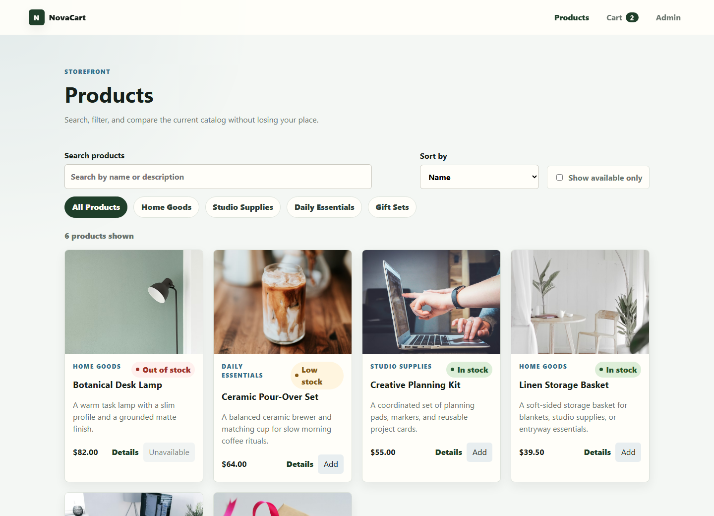
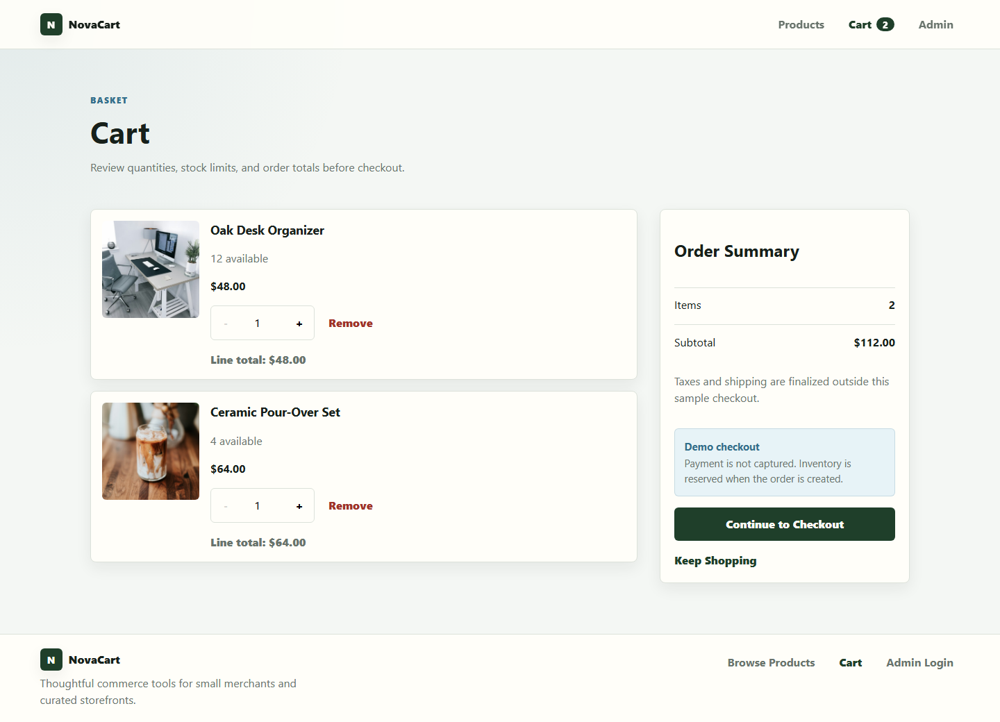
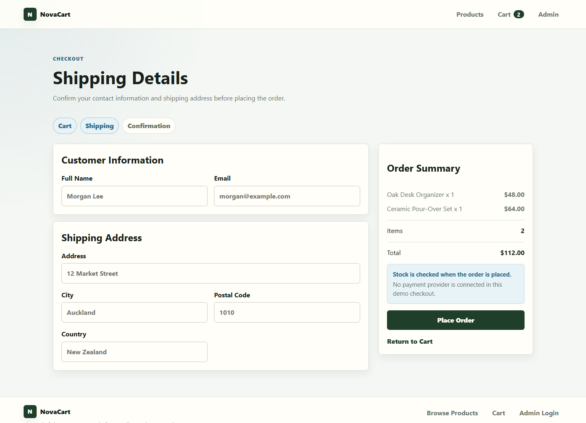
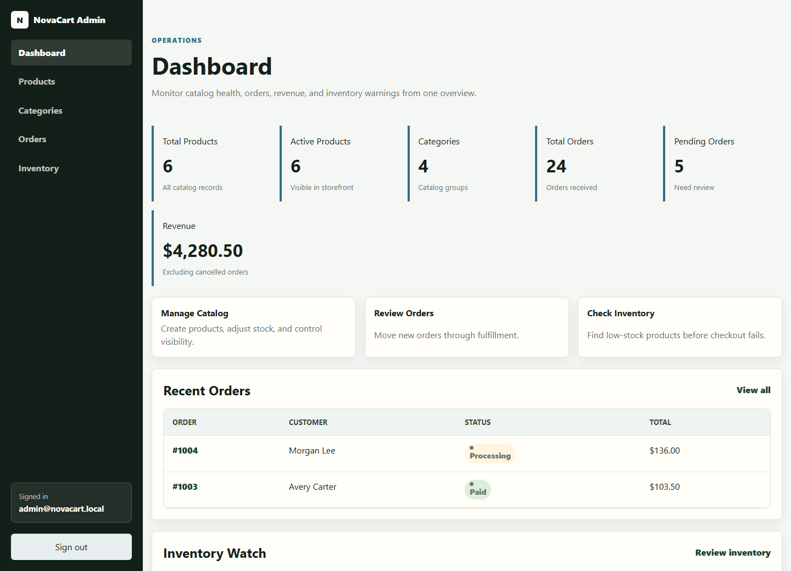
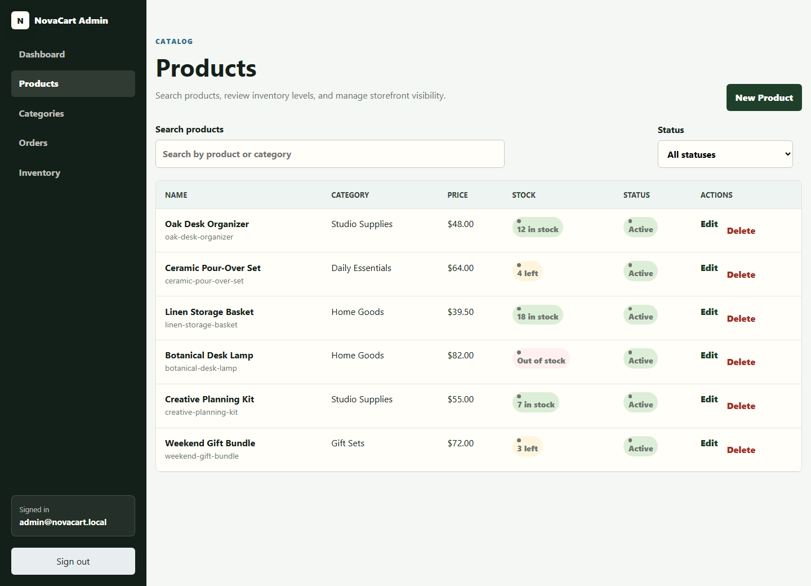
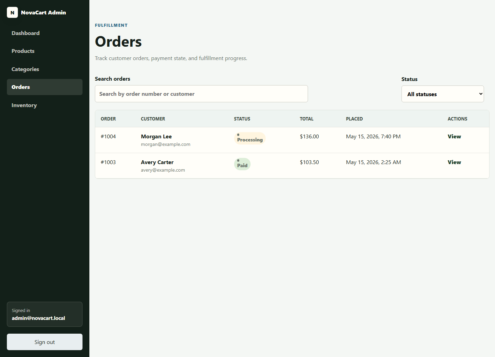
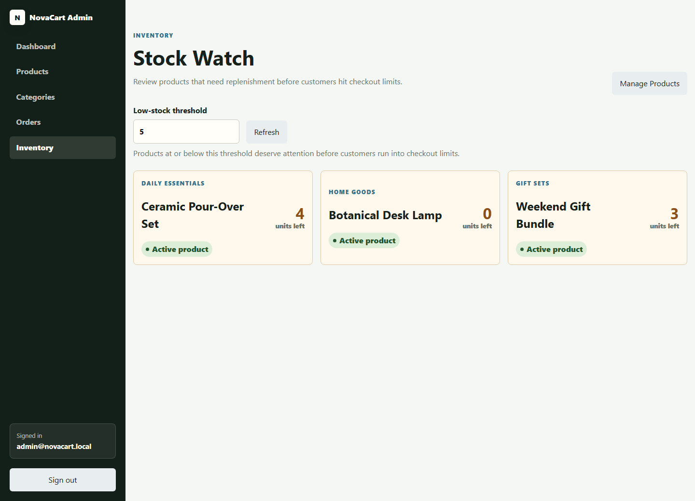
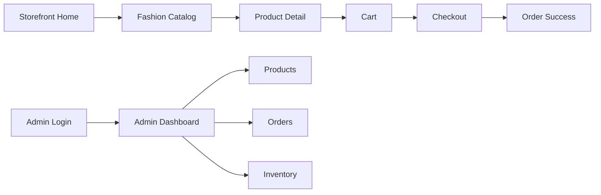

# NovaCart Fashion Commerce Platform

NovaCart Fashion Commerce Platform is a full-stack online store system for fashion and lifestyle merchants. It includes a customer storefront, a protected merchant operations workspace, MySQL persistence, JWT authentication, checkout with stock validation, order management, inventory warnings, and a RESTful JSON API.

The project is intentionally original in naming, layout, and content. All visible text, seed data, API messages, comments, documentation, and commit messages are written in English.

## Current Release Highlights

- Fashion/lifestyle catalog direction with original seed data for Women, Men, Bags, Jewelry, Shoes, Sportswear, Accessories, New Arrivals, Sale, and Seasonal Collection.
- Rich product records with fictional private labels, slugs, SKU, compare-at pricing, stock thresholds, sizes, colors, material, care instructions, gallery images, tags, season, gender target, status, featured flag, category, and collection.
- Seasonal collection model seeded with Spring Edit, Summer Essentials, Workwear Capsule, Evening Details, Active Weekend, and End of Season Sale.
- Promotion engine for percentage or fixed-amount discounts targeted to selected products, category, collection, season, or tags. Storefront prices, cart totals, and checkout totals use effective discounted prices.
- Customer storefront support for product browsing, filters, detail variants, cart, demo checkout, payment decline/approval states, order confirmation, support tickets, and refund requests.
- Merchant workspace for dashboard analytics, product/category/collection/promotion management, order fulfillment, refund queue, support queue, guest customer records, inventory warnings, and manual stock adjustments.
- Guest customer records are created from checkout email and used for repeat customer and preference analytics.
- Demo payment only. No real payment provider or card collection is connected.

## Project Status

NovaCart is a production-style fashion commerce system for clothing, bags, jewelry, accessories, shoes, sportswear, sports equipment, seasonal collections, sale edits, and lifestyle fashion products. It is not a live payment-processing store and should not be used for real customer transactions without additional production hardening, payment integration, observability, legal review, and operational security controls.

## Product Features

### Storefront Experience

- Responsive fashion storefront homepage with a seasonal hero, campaign links, category highlights, featured products, and retail value cards.
- Product catalog with fashion categories, server-side search, category, collection, tag, price range, sale, availability filtering, sorting, pagination, stock badges, loading states, empty states, and friendly error states.
- Product detail pages with large fashion imagery, category context, clear price hierarchy, quantity selection, stock status, related products, and add-to-cart feedback.
- Cart page with item summaries, quantity controls, stock-aware limits, remove actions, subtotal calculation, and a clear checkout path.
- Checkout flow with customer information, shipping address fields, demo shipping method selection, demo payment approval or decline handling, order summary, basic validation, idempotency protection, and backend stock validation.
- Order success page with confirmation messaging, order number, payment status, shipping method, item summary, totals breakdown, and clear next steps.
- Customer service page for refund, exchange, shipping, product, payment, and other support tickets.
- Refund request page that validates order number and email, stores the request, and lets admin users move requests through review.

### Merchant Admin Workspace

- Protected admin login with JWT authentication, persisted sessions, expired-session handling, and BCrypt password support on the backend.
- Dashboard metrics for total products, active products, total orders, total revenue, low-stock products, and recent order activity.
- Product management with searchable fashion tables, status filters, inventory indicators, SKU, private label, compare-at price, tags, gallery, featured flag, create/edit forms, validation feedback, and delete confirmation.
- Collection management for seasonal edits, campaign imagery, featured status, active/draft/archive status, dates, and sort order.
- Promotion management for bulk markdowns across selected products, categories, collections, seasons, or tags with guided target selection.
- Category management for Women, Men, Bags, Jewelry, Shoes, Sportswear, Accessories, New Arrivals, Sale, and Seasonal Collection.
- Order management with search, status filtering, order detail views, customer information, fashion item summaries, totals, and status updates.
- Refund and support ticket management with status updates for customer care workflows.
- Customer records and analytics for guest checkout profiles, top regions, best sellers, sales trends, and customer preferences.
- Inventory warning screen with product thresholds, manual stock adjustments, replenishment indicators, recent stock movement history, and fast navigation back to product management.

### Platform Capabilities

- RESTful JSON API with consistent response envelopes and centralized error handling.
- MySQL persistence through Spring Data JPA and Hibernate.
- Transactional checkout logic that prevents insufficient-stock purchases, negative inventory, and duplicate order creation from repeated submissions.
- Stock movement history for checkout deductions, cancellation restorations, and manual inventory adjustments.
- Public storefront APIs separated from protected admin APIs.
- Vue 3 frontend with Vue Router, Pinia state management, Axios API wrappers, and reusable UI components.
- English-only interface, documentation, API messages, seed data, and comments.

## Key Advantages

- Built as a full-stack production-style project rather than a single-page mockup.
- Clear separation between controllers, services, repositories, DTOs, entities, security, and frontend API modules.
- Original visual design, product names, descriptions, fictional labels, seed data, and local catalog artwork created specifically for NovaCart.
- Responsive layouts for storefront and admin workflows across mobile, tablet, and desktop screens.
- Practical merchant workflows covering catalog setup, checkout, fulfillment, and inventory monitoring.
- Safer checkout behavior through backend stock checks and frontend quantity controls.
- Developer-friendly setup with Maven wrapper, Vite scripts, environment examples, tests, and troubleshooting notes.
- Maintainable UI system with shared components for page headers, product cards, loading states, empty states, error messages, status badges, quantity controls, metrics, and feedback.

## Security Notes

- The default admin account is intended for local development only.
- `JWT_SECRET` must be replaced with a long, random secret before any deployed environment is exposed.
- Database credentials, JWT secrets, and deployment-specific values must be supplied through environment variables or a secret manager.
- No real payment provider is connected. Checkout creates a NovaCart order and deducts inventory, but it does not authorize or capture payment.
- Public storefront endpoints are intentionally open. Admin endpoints require a valid bearer token.
- Password hashes are stored with BCrypt and are never returned by API responses.

## Limitations And Future Improvements

- Add a real payment provider integration before supporting paid transactions.
- Add customer accounts, saved addresses, order history, and account-level authorization if customer self-service is required.
- Add pagination and server-side search for larger product and order datasets.
- Add audit logging for admin changes and fulfillment status updates.
- Add reserved stock, supplier notes, and fuller inventory audit reporting.
- Add production observability, structured logs, rate limiting, backups, and monitoring.
- Add broader frontend automated tests and end-to-end coverage for critical checkout and admin flows.

## Application Preview

Run the backend and frontend locally, then open the Vite app at `http://localhost:5173`.

The screenshots below are generated from the current Vue interface with representative preview data, so readers can see the product experience before running the project locally.

### Storefront Screens

| Home | Fashion Catalog |
| --- | --- |
|  |  |
| Premium landing page with hero messaging, category highlights, featured products, and trust/value cards. | Searchable catalog with category filters, price sorting, product cards, stock badges, and add-to-cart actions. |

| Product Detail | Cart |
| --- | --- |
|  |  |
| Detailed product page with image focus, category label, price hierarchy, stock indicator, quantity selector, related products, and cart feedback. | Cart review page with item images, quantity controls, stock-aware limits, line totals, subtotal summary, and checkout action. |

| Checkout | Order Success |
| --- | --- |
|  |  |
| Checkout form with customer details, shipping address, order summary, validation states, and protected submit behavior. | Confirmation page with order number, item summary, order total, next-step messaging, and shopping links. |

### Admin Screens

| Admin Login | Dashboard |
| --- | --- |
|  |  |
| Professional admin sign-in screen with secure access messaging, password visibility control, loading state, and error feedback. | Merchant dashboard with revenue, order, product, category, recent order, and low-stock signals. |

| Product Management | Order Management |
| --- | --- |
|  |  |
| Product table with search, status filters, category context, pricing, stock badges, active/inactive badges, edit actions, and delete confirmation. | Order table with customer details, status badges, total amount, placed date, search, status filtering, and order detail links. |

| Inventory Warnings |
| --- |
|  |
| Inventory screen with configurable warning threshold, manual stock adjustment, refresh action, low-stock cards, active/inactive context, and recent movement history. |

### Feature Map

| Area | Route | Preview Focus |
| --- | --- | --- |
| Storefront Home | `/` | Fashion hero section, seasonal campaign links, category highlights, featured products, trust/value cards, and responsive navigation. |
| Fashion Catalog | `/products` | Search, filtering, sorting, product cards, stock indicators, and add-to-cart actions. |
| Product Detail | `/products/:id` | Product imagery, details, price, quantity selector, stock messaging, and related products. |
| Cart | `/cart` | Cart items, quantity controls, subtotal summary, remove actions, and checkout call to action. |
| Checkout | `/checkout` | Customer form, shipping address, order summary, validation states, and order creation flow. |
| Order Success | `/order-success/:id` | Confirmation message, order number, totals, item summary, and next-step actions. |
| Admin Login | `/admin/login` | Secure admin entry screen with error handling and loading state. |
| Admin Dashboard | `/admin/dashboard` | Metrics, recent orders, low-stock products, and operational overview. |
| Admin Products | `/admin/products` | Searchable product table, status badges, stock badges, and management actions. |
| Admin Categories | `/admin/categories` | Category list, create/edit form, empty state, and delete confirmation. |
| Admin Orders | `/admin/orders` | Searchable order table, status filters, totals, dates, and detail links. |
| Admin Inventory | `/admin/inventory` | Low-stock threshold controls, manual adjustments, replenishment warning cards, and recent stock movement history. |

Suggested preview flow:

1. Open `/` and review the storefront landing experience.
2. Browse `/products`, search for a product, filter by category, and sort by price.
3. Open a product detail page, choose a quantity, and add the item to the cart.
4. Review `/cart`, adjust quantities, then continue to `/checkout`.
5. Place an order and review the confirmation page.
6. Sign in at `/admin/login` with the default admin account and inspect dashboard, products, categories, orders, and inventory pages.



## Tech Stack

- Backend: Java 21, Spring Boot 4.0.6, Maven wrapper
- Frontend: Vue 3, Vite, Vue Router, Pinia, Axios
- Database: MySQL for application runtime
- Test database: H2 in MySQL compatibility mode
- ORM: Spring Data JPA and Hibernate
- Authentication: JWT with BCrypt password hashing
- Styling: Responsive custom CSS
- API style: RESTful JSON

## Folder Structure

```text
novacart-ecommerce/
  backend/
    src/main/java/com/novacart/store/
      config/
      controller/
      dto/
      entity/
      exception/
      repository/
      security/
      service/
      service/impl/
    src/main/resources/
    src/test/java/com/novacart/store/
    src/test/resources/
  frontend/
    src/
      api/
      assets/
      components/
      layouts/
      pages/
      router/
      stores/
      utils/
  docs/
```

## Quick Start

1. Create the MySQL database and user shown in the MySQL setup section.
2. Configure backend environment variables from [backend/.env.example](backend/.env.example).
3. Start the backend from `backend/`.
4. Configure the frontend API URL from [frontend/.env.example](frontend/.env.example).
5. Install frontend dependencies and start Vite from `frontend/`.

Unix/macOS:

```bash
cd backend
export DB_HOST=localhost
export DB_PORT=3306
export DB_NAME=novacart
export DB_USERNAME=novacart_user
export DB_PASSWORD=novacart_password
export JWT_SECRET=replace-with-a-long-random-secret-for-local-development
./mvnw spring-boot:run
```

Windows PowerShell:

```powershell
cd backend
$env:DB_HOST="localhost"
$env:DB_PORT="3306"
$env:DB_NAME="novacart"
$env:DB_USERNAME="novacart_user"
$env:DB_PASSWORD="novacart_password"
$env:JWT_SECRET="replace-with-a-long-random-secret-for-local-development"
.\mvnw.cmd spring-boot:run
```

Frontend:

```bash
cd frontend
npm install
npm run dev
```

## Backend Setup

The backend uses the Maven wrapper, so a global Maven install is not required.

Requirements:

- Java 21
- MySQL 8 or compatible

From the `backend/` directory:

```bash
./mvnw test
./mvnw spring-boot:run
```

On Windows PowerShell:

```powershell
.\mvnw.cmd test
.\mvnw.cmd spring-boot:run
```

## Frontend Setup

Requirements:

- Node.js 20 or newer
- npm

From the `frontend/` directory:

```bash
npm install
npm run dev
npm run build
```

On Windows PowerShell, use `npm.cmd` if script execution policy blocks the npm shim:

```powershell
npm.cmd install
npm.cmd run dev
npm.cmd run build
```

The Vite development server runs on:

```text
http://localhost:5173
```

## MySQL Setup

Create a local database and user for NovaCart:

```sql
CREATE DATABASE novacart CHARACTER SET utf8mb4 COLLATE utf8mb4_unicode_ci;
CREATE USER 'novacart_user'@'localhost' IDENTIFIED BY 'novacart_password';
GRANT ALL PRIVILEGES ON novacart.* TO 'novacart_user'@'localhost';
FLUSH PRIVILEGES;
```

The backend can create the database automatically when the configured MySQL user has permission, but creating it explicitly is clearer for local development.

## Environment Variables

Backend values are documented in [backend/.env.example](backend/.env.example).

```text
DB_HOST=localhost
DB_PORT=3306
DB_NAME=novacart
DB_USERNAME=novacart_user
DB_PASSWORD=novacart_password
JWT_SECRET=replace-with-a-long-random-secret-for-local-development
JWT_EXPIRATION_MINUTES=120
CORS_ALLOWED_ORIGINS=http://localhost:5173
SERVER_PORT=8080
```

Frontend values are documented in [frontend/.env.example](frontend/.env.example).

```text
VITE_API_BASE_URL=http://localhost:8080/api
```

Secrets must not be committed. Use environment variables or ignored local files for machine-specific settings.

## Seed Data

The backend seeds:

- One admin account
- Storefront categories
- Sample products with English names, descriptions, and image URLs

Default admin account:

```text
Email: admin@novacart.local
Password: NovaCartAdmin123!
```

Change the seeded password before using the project beyond local development.

## API Overview

See [docs/API.md](docs/API.md) for request examples, response shapes, and security behavior.

Public APIs:

- `GET /api/public/categories`
- `GET /api/public/products`
- `GET /api/public/products/{id}`
- `POST /api/public/orders`
- `GET /api/public/orders/{id}`

Admin authentication:

- `POST /api/admin/auth/login`

Admin catalog APIs:

- `GET /api/admin/categories`
- `POST /api/admin/categories`
- `PUT /api/admin/categories/{id}`
- `DELETE /api/admin/categories/{id}`
- `GET /api/admin/products`
- `GET /api/admin/products/{id}`
- `POST /api/admin/products`
- `PUT /api/admin/products/{id}`
- `DELETE /api/admin/products/{id}`

Admin order and operations APIs:

- `GET /api/admin/orders`
- `GET /api/admin/orders/{id}`
- `PATCH /api/admin/orders/{id}/status`
- `GET /api/admin/dashboard/metrics`
- `GET /api/admin/inventory/warnings`
- `POST /api/admin/inventory/adjustments`

All API responses use a consistent JSON envelope. Validation and security errors return English messages without exposing sensitive implementation details.

## Frontend Routes

Public storefront:

- `/`
- `/products`
- `/products/:id`
- `/cart`
- `/checkout`
- `/order-success/:id`

Admin:

- `/admin/login`
- `/admin/dashboard`
- `/admin/products`
- `/admin/products/new`
- `/admin/products/:id/edit`
- `/admin/categories`
- `/admin/orders`
- `/admin/orders/:id`
- `/admin/inventory`

## Frontend UX Notes

The Vue storefront includes a responsive homepage, searchable product catalog, category filters, price sorting, polished product detail pages, cart quantity controls, checkout validation, and order confirmation views. Shared UI components provide consistent page headers, product cards, loading states, empty states, error messages, quantity controls, metric cards, status badges, and toast feedback.

The admin workspace includes protected routing, session expiry handling, dashboard metrics, searchable product and order tables, inventory warning cards, category management feedback, and responsive navigation with keyboard skip links. The frontend API client centralizes bearer token handling and friendly error messages for validation, authentication, and unavailable backend states.

## Testing And Builds

Backend:

```bash
cd backend
./mvnw test
```

Frontend:

```bash
cd frontend
npm install
npm run build
```

## Docker Preview

NovaCart includes Docker configuration for local containerized preview with MySQL, backend, and frontend services:

```bash
cp docker.env.example .env
docker compose up --build
```

On Windows PowerShell:

```powershell
Copy-Item docker.env.example .env
docker compose up --build
```

Container preview URLs:

- Frontend: `http://localhost:3000`
- Backend API: `http://localhost:8080/api`
- MySQL: `localhost:3306`

The Docker Compose credentials are local demo values only. Override ports, credentials, frontend origin, or API URL in the ignored `.env` file when needed. See [docs/DEPLOYMENT.md](docs/DEPLOYMENT.md) before preparing any deployed environment.

## Development Notes

- Public storefront APIs are open.
- Admin APIs require a bearer token from the admin login endpoint.
- Checkout uses a transaction and pessimistic product locking to prevent negative stock.
- Controllers delegate business logic to services.
- DTOs define request and response boundaries.
- The frontend stores cart and admin session data in browser local storage.
- Keep all user-facing text and seed data in English.
- Commit changes in meaningful, stable units after running relevant checks.

## Troubleshooting

- If Maven commands fail, confirm Java 21 is installed and available on the system path.
- If MySQL connection fails, verify host, port, database name, username, password, and database privileges.
- If JWT login fails, confirm the seeded admin account exists and the backend has a sufficiently long `JWT_SECRET`.
- If browser requests are blocked by CORS, verify `CORS_ALLOWED_ORIGINS` includes the frontend origin.
- If npm is blocked in PowerShell, use `npm.cmd` commands.
- If frontend requests fail, confirm `VITE_API_BASE_URL` points to the backend API root.
- If backend port `8080` is already in use, set `SERVER_PORT` to another port and update `VITE_API_BASE_URL`.
- If frontend port `5173` is already in use, Vite will offer another port; update `CORS_ALLOWED_ORIGINS` if the origin changes.
- If admin requests return `401`, sign in again and confirm the request includes the bearer token from `/api/admin/auth/login`.
- If admin requests return `403`, confirm the authenticated account has the `ADMIN` role.
