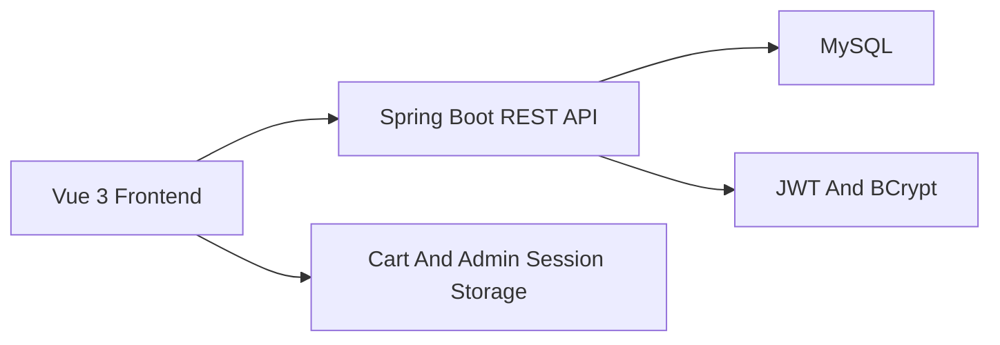

# NovaCart Architecture

NovaCart is organized as a full-stack ecommerce application with a public storefront, a protected merchant administration workspace, and a Spring Boot API that owns validation, persistence, authentication, and checkout rules.

## System Overview



## Backend Layers

- `controller`: REST endpoint boundaries for public catalog, checkout, admin auth, catalog management, order management, dashboard metrics, and inventory warnings.
- `dto`: Request and response contracts for API payloads, validation errors, login responses, dashboard metrics, and order data.
- `service`: Business interfaces for catalog, checkout, authentication, and dashboard behavior.
- `service/impl`: Transactional business logic, stock deduction, slug generation, authentication, and DTO mapping.
- `repository`: Spring Data JPA repositories for admins, categories, products, orders, product locking, and stock movement history.
- `entity`: JPA models for admins, categories, products, customer orders, order items, order statuses, payment statuses, shipping methods, and stock movements.
- `security`: JWT generation/parsing, bearer-token request filtering, and admin user loading.
- `exception`: Domain exceptions and global JSON error handling.
- `config`: Security, CORS, password encoding, and seed data configuration.

## Frontend Structure

- `api`: Axios client wrapper and endpoint modules for catalog, orders, and admin APIs.
- `assets`: Global responsive CSS and design system primitives.
- `components`: Reusable UI building blocks such as headers, cards, status badges, loading states, empty states, errors, metrics, and quantity controls.
- `layouts`: Storefront and admin shells.
- `pages`: Route-level storefront and admin workflows.
- `router`: Vue Router configuration and admin route guards.
- `stores`: Pinia stores for cart and admin session state.
- `utils`: Formatting helpers for currency, dates, and statuses.

## Authentication Flow

1. An admin submits email and password to `POST /api/admin/auth/login`.
2. The backend verifies the active admin user and BCrypt password hash.
3. The backend returns a JWT bearer token with email subject, role claim, and expiration.
4. The frontend stores the session in local storage and sends `Authorization: Bearer <token>` on admin API requests.
5. The JWT filter validates bearer tokens before protected endpoints.
6. Missing, expired, or invalid tokens return a consistent `401` JSON error. Authenticated users without access receive `403`.

## Checkout Flow

1. The storefront cart stores product snapshots and quantities in browser local storage.
2. Checkout submits customer information, shipping details, demo payment selection, idempotency key, and product quantities to `POST /api/public/orders`.
3. The order service aggregates duplicate product IDs into a single requested quantity per product.
4. Each product is loaded with a pessimistic database lock.
5. The backend rejects inactive products, missing products, invalid quantities, insufficient stock, and empty carts.
6. The demo payment step can approve or safely decline without collecting real payment details.
7. Valid checkout deducts stock, records stock movements, creates order items, calculates subtotal, shipping, tax, discount, and total amounts, and saves the customer order in one transaction.
8. Repeated requests with the same idempotency key return the original order instead of deducting stock twice.
9. The frontend clears the cart and routes to the order success page.

## Database Entities

- `AdminUser`: Admin email, BCrypt password hash, role, active flag, and timestamps.
- `Category`: Catalog grouping with name, slug, optional description, active flag, and timestamps.
- `Product`: Product catalog data, SKU, brand, price, compare-at price, stock quantity, low-stock threshold, image gallery, tags, featured flag, product status, active flag, category relationship, and timestamps.
- `CustomerOrder`: Customer contact/shipping data, order number, idempotency key, payment status, shipping method, fulfillment status, totals breakdown, order items, and timestamps.
- `OrderItem`: Product snapshot, unit price, quantity, and line total for each order.
- `StockMovement`: Inventory event history for checkout deductions, cancellation restorations, manual adjustments, and seed data.

## API Response Shape

Successful responses use:

```json
{
  "success": true,
  "message": "Products loaded successfully.",
  "data": [],
  "timestamp": "2026-05-15T00:00:00Z"
}
```

Error responses use:

```json
{
  "success": false,
  "message": "Validation failed. Please review the highlighted fields.",
  "status": 400,
  "path": "/api/public/orders",
  "errors": [
    {
      "field": "customerEmail",
      "message": "Enter a valid email address."
    }
  ],
  "timestamp": "2026-05-15T00:00:00Z"
}
```
